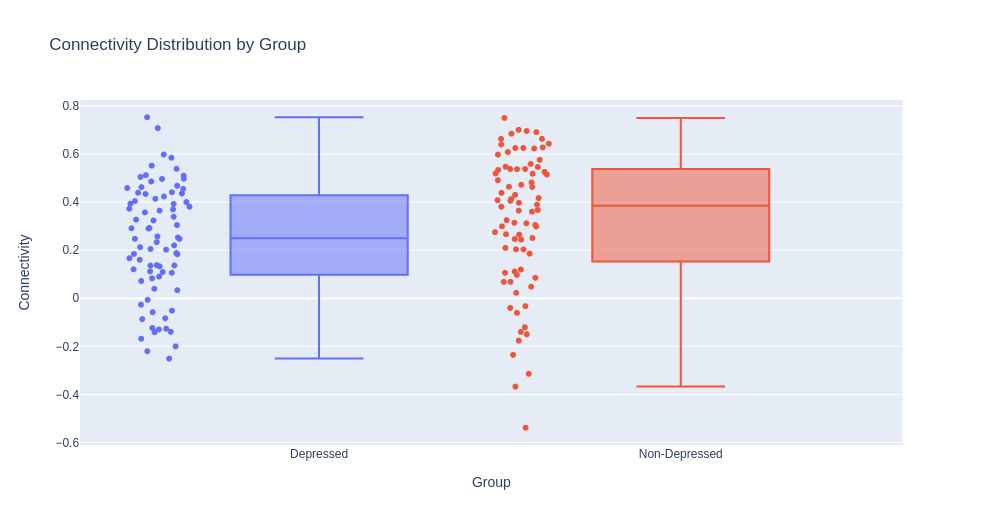
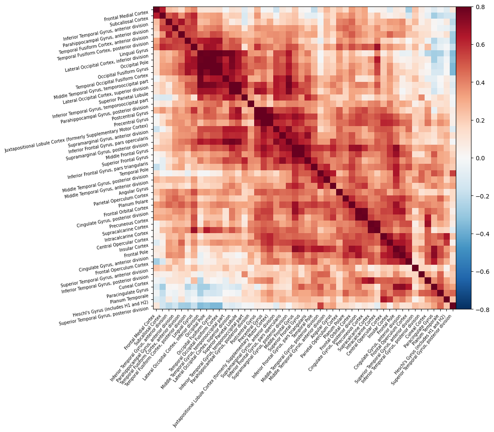
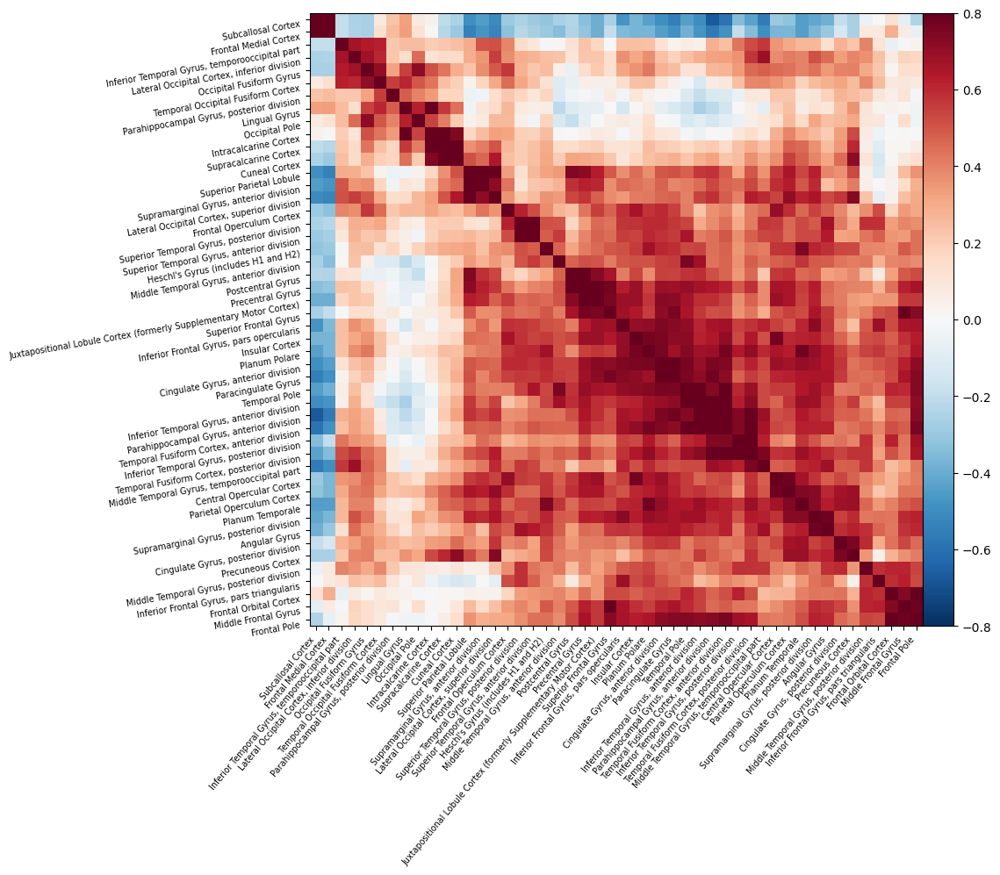
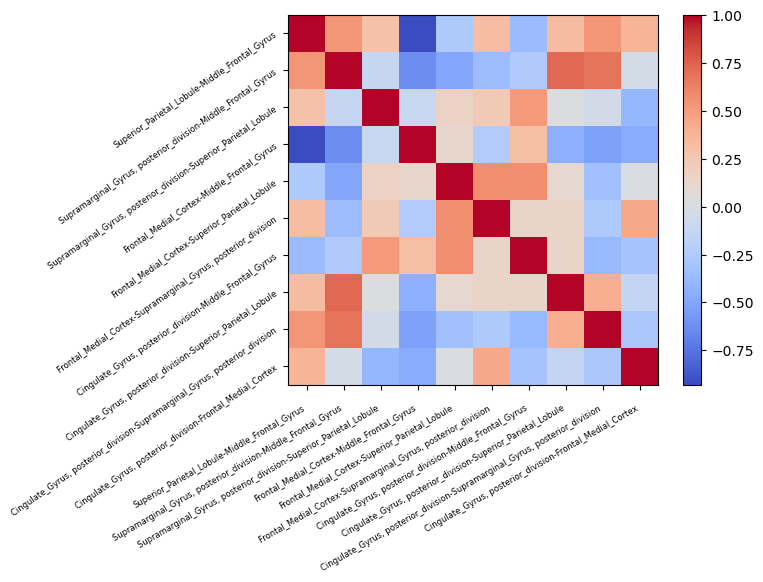
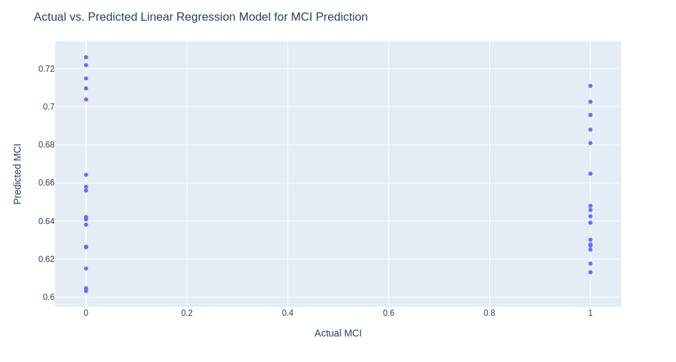
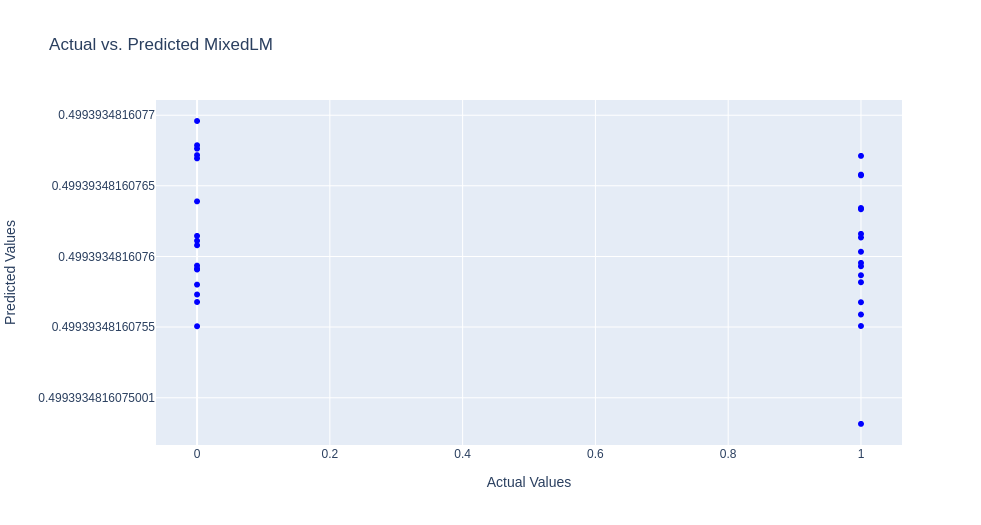
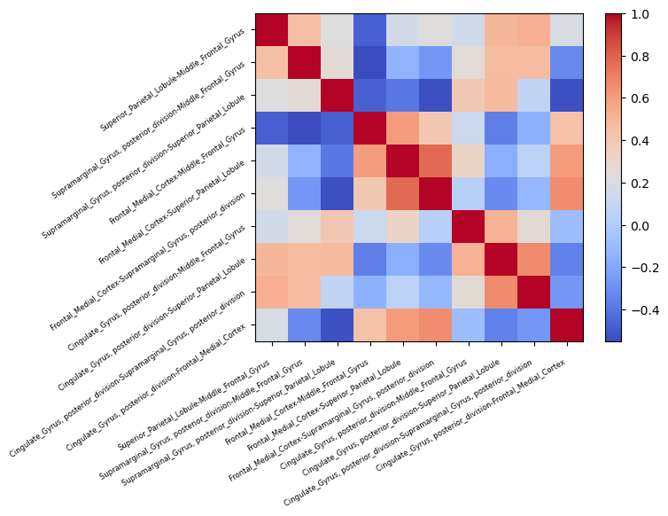
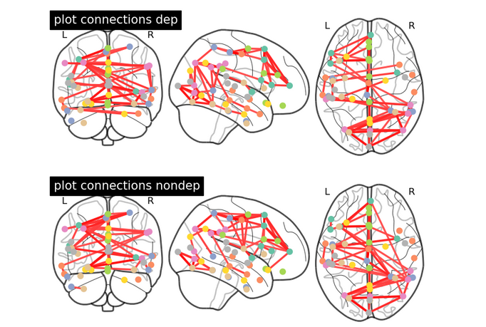
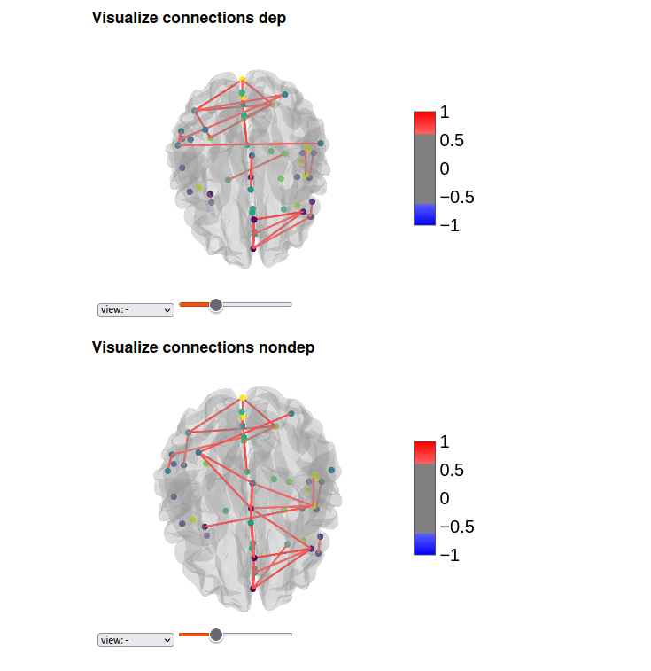

<a href="https://github.com/moqroq">
   
    <b>Roqa Moqa</b>
</a> 

Hi, I am Roqa, from UdeM hub, PhD student at University de Montreal in biomedical sciences.
I am working on neurodegenerative diseases including Parkinson's.

# Project Definition

## About Me

Hi, I am Roqa, from UdeM hub, PhD student at University de Montreal in biomedical sciences. Throughout my master's program, I specialized in medical imaging, which provided me with knowledge of diagnostic and imaging techniques utilized in the field. However, for my PhD, I need to familiarize myself with the state-of-the-art data science packages.

## Project Summary

My project aims to elucidate and compare the distinct functional connectivity patterns between individuals with Parkinson's disease and neuropsychiatric symptoms (PD+NPS) and those without the condition, using resting-state fMRI connectivity matrices.

### Specific Objectives Include:

- Characterizing the functional connectivity alterations in individuals with PD+NPS by examining the connectivity matrix derived from resting-state fMRI data.
- Identifying and mapping disrupted functional brain networks associated with PD+NPS and investigating their potential relevance to motor and neuropsychiatric symptomatology.
- Comparing the functional connectivity patterns between individuals with PD+NPS and healthy controls to delineate the specific network alterations unique to the PD+NPS population.

### Personal Objectives

- Familiarize myself with state-of-the-art data science packages and tools for neuroimaging analysis.
- Develop expertise in interpreting and visualizing resting-state fMRI connectivity data.
- Understand advanced visualization techniques for neuroimaging data.

## Abstract

This project aims to explore and compare the functional connectivity patterns in individuals with Parkinson's disease (PD) and neuropsychiatric symptoms (NPS) to those without the condition, utilizing resting-state functional magnetic resonance imaging (rs-fMRI) connectivity matrices. By examining the connectivity matrix derived from rs-fMRI data, we aim to identify potential alterations in functional brain networks associated with both PD and NPS, shedding light on the relationship between these conditions. The findings from this study may contribute to a better understanding of the underlying neural mechanisms and inform future research and clinical interventions.

## Result

## Output Images

## Tools

- Jupyter notebook for coding and visualization
- Docker container
- fMRIPrep for rs-fMRI preprocessing
- Python Packages: matplotlib, seaborn, nilearn, plotly, Nibabel, scipy, Pandas
- Git and Github for Version Control
- Docker container

